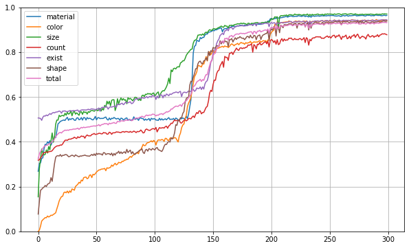

# relation-networks-pytorch
Relation Networks (https://arxiv.org/abs/1706.01427) for CLEVR implemented in PyTorch

Requirements:
* Python 3.6
* PyTorch
* torch-vision
* Pillow
* nltk
* tqdm

To train:

1. Download and extract CLEVR v1.0 dataset from http://cs.stanford.edu/people/jcjohns/clevr/
2. Preprocessing question data
```
python preprocess.py [CLEVR directory]
```
3. Run train.py
```
python train.py [CLEVR directory]
```

# Reproduce status

Finally reproduced this, thanks to [@mesnico](https://github.com/mesnico) ! (https://github.com/mesnico/RelationNetworks-CLEVR) Crucial configurations to reproduce the result is large batch sizes (640), increase learning rate to 2x for every 20 epochs until it reaches maximum learning rate, and inverting questions, that is, feed question words into LSTM in reverse order.

Accuracy plots


